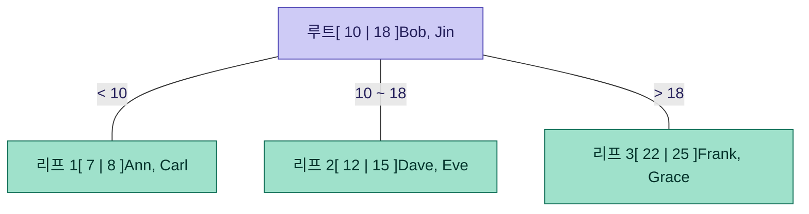
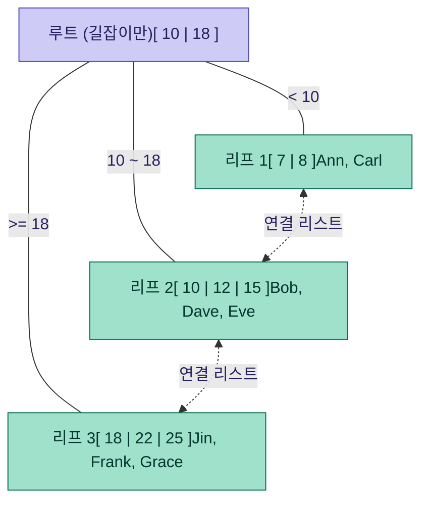
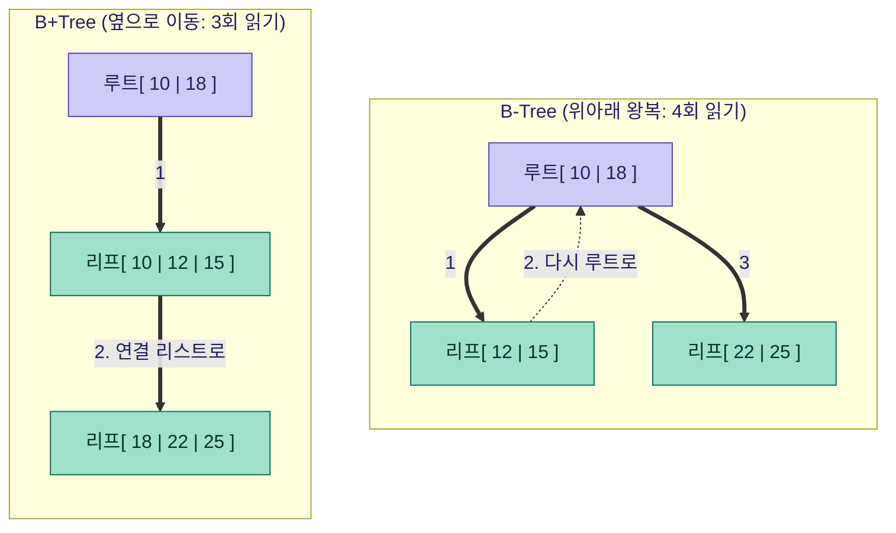

## 어떤 개념인가요 ?

### B-Tree

데이터를 정렬된 상태로 유지하면서, 한 노드에 여러개의 키와 자식에 대한 포인터를 담을 수 있는 다진 균형 트리이다.

이진 트리처럼 자식이 2개로 제한되지 않으며, 한 노드가 2개 이상의 자식을 가질 수 있어서 트리의 높이가 매우 낮게 유지된다.

### B+Tree

B-Tree의 변형 버전이다.

차이점 2가지

1. 실제 데이터는 리프 노드에만 저장이 된다. 내부 노드들은 오직 탐색 경로 안내용 키만 가진다.
2. 리프 노드들이 연결 리스트로 서로 이어져 있다.

대부분의 데이터 베이스 (MySQL의 InnoDB, PostgreSQL 등)와 파일 시스템(NTFS, ext4)의 인덱스는 B-Tree가 아니아 B+Tree를 쓴다고 한다.

## 어떤 문제를 해결하려고 나왔나?

B+Tree는 `디스크의 I/O를 최소화하자`는 목적으로 나오게 되었다.

메모리(RAM) 접근은 나노초 단위인데, 디스크 접근은 밀리초 단위이다.
약 10만 배 차이가 나게된다. 그래서 데이터가 메모리에 다 안들어가고 디스크에 있어야 하는 상황 (대부분의 DB)에서는, `비교 횟수` 보다 `디스크 접근 횟수` 를 줄이는게 훨씩 중요하였다.

이진 탐색 트리 BST나 AVL, Red-Black Tree는 한 노드에 키가 1개뿐이라 데이터가 많아지면 트리의 높이가 깊어진다. 즉, 디스크를 그만큼 많이 읽어야 한다 즉, 속도가 느리게 된다.

그레서 한번 디스크에서 블록을 읽어올 때 어차피 4KB, 8KB 씩 통째로 읽어오는데,
그 블록 안에 키를 최대한 많이 욱여넣다는 발상이 B-Tree라고 한다.

## 어떻게 동작하나? (큰 그림)

### B-Tree

- 한 노드 = 디스크 블록 1개 (보통 4KB, 8KB, 16KB)
- 한 노드 안에 정렬된 키 여러개 + 자식 포인터들이 들어있음
- 모든 리프 노드는 같은 깊이 (균형 트리)
- 탐색: 루트에서 시작해서 노드 안에서 키를 비교해 어느 자식으로 갈지 결정하면서 리프 노드까지 내려감
- 삽입/삭제 시에 노드가 너무 차거나 빔ㄴ 분할 또는 병합을 하여 균형을 유지한다.

### B+Tree

- 내부 노드는 길잡이 역할만 하고, 실제 값은 리프에만 있다.
- 내부 노드에 키를 더 많이 넣을 수 있어서 트리 높이가 더 낮아진다.
- 리프가 연결 리스트로 묶여 있어서 `범위 검색` 이 매우 빠르다.
예를 들어서 `WHERE age BETWEEN 20 AND 30` 은 시작 지점만 트리로 찾고, 그 다음부터는 리프 리스트를 순차적으로 쭉 읽으면 끝이다.

수십억 건의 데이터이어도 트리의 높이가 3-4단계만 거치면 도달할 수 있게 된다고 한다.
즉, 디스크를 3-4번만 읽으면 원하는 데이터를 찾을 수 있다고 한다.

## 언제 쓰고, 언제 안 쓰나?

쓸 때:

- 데이터 베이스의 인덱스 (관계형 DB의 표준)
- 파일 시스템의 디렉터리/파일 메타데이터 인덱싱
- 범위 검색이 중요한 경우 → B+Tree가 압도적으로 성능이 좋다.
- 데이터가 메모리에 다 안들어가는 대용량의 상황
- 정렬된 순회가 필요한 경우

안 쓸 때:

- 단일 키의 정확한 일치 검색만 압도적으로 많을 때
해시 인덱스가 평균 O(1)으로 더 빠르다. 
예시로, Redis의 key-value 조회가 있다.
- 데이터가 전부 메모리에 들어가는 작은 규모로 굳이 B-Tree의 디스크 친화적 구조가 필요 없다. 
이런 상황에서는 일반 BST/RB-TREE로 충분하다.
- 쓰기가 폭발적으로 많은 데이터일 때, 분할/병합 비용이 더 부담된다.
이런 상황에서는 LSM-TREE가 더 적합하다.
- 전문(full-text) 검색의 경우는 역색인이 적합하다 (Elasticsearch)

### B-Tree

### B+Tree

### 범위 쿼리 검색 비교

## 남에게 설명한다면 어떻게 설명할 것인가?

