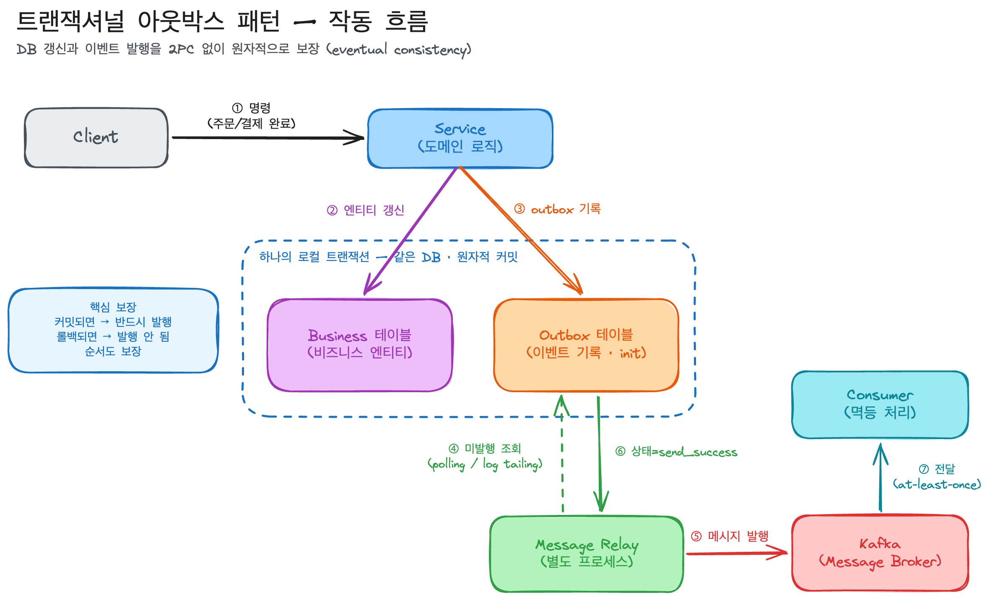

## 어떤 개념일까?

DB 업데이트와 메시지 발행을 하나의 로컬 트랜잭션으로 묶기 위해,
발행할 메시지를 같은 DB의 outbox 테이블에 함께 저장하고,
별도 프로세스가 그걸 읽어 브로커로 보내는 패턴이다.

### 트랜잭셔널 메시징이란?

서비스 로직 실행과 그 이후의 이벤트 발행을 원자적으로 함께 실행하는 것이다.

하나의 명령은 보통 DB의 애그리거트를 생성/수정/삭제 하면서 동시에 메시지 브로커로 메시지, 이벤트를 보내야 하는데, 이둘이 모두 성공하거나 모두 실패하도록 보장하는 것이 트랜잭셔널 메시징이다.

이걸 구현하는 방법이 2가지가 있다.

- 트랜잭셔널 아웃박스 패턴
- CDC (change Data Capture)

### 트랜잭셔널 아웃박스 패턴이란?

메시지를 보내는 서비스가, 비즈니스 엔티티를 갱신하는 그 트랜잭션의 일부로서 
메시지를 먼저 DB에 저장하고, 별도의 프로세스가 그 메시지를 메시지 브로커로 발행하는 방식이다.

즉, `메시지를 외부로 보내는 행위`를 트랜잭션에 넣는게 아니라 `메시지를 보내겠다는 기록` 을 같은 DB에 넣어서 원자성을 확보한다는 것이다.

### 29CM의 실제 구현 사례

29CM에서는 MSA 전환 후에 동기 HTTP API의 한계를 느껴서 Kafka 기반 EDA를 도입하였고, 상품 도메인에 이 패턴을 적용했다.

CDC도 검토하였지만, 아웃박스를 택했는데, 이유는 다음과 같았다.

- 팀에 CDC 경험이 없었다.
- 발행 메시지 형태가 테이블 스키마에 의존적이라 애플리케이션이 원하는 형태로 메시지를 만들기 어렵다.
- 테이블 스키마가 바뀌면 메시지 형태도 바뀌어 로직 변경을 유발한다.

Spring의 `ApplicationEventPublisher` + `@TransactionalEventListener` 조합으로 코드 레벨에서 직접 만듬.

---

## 어떤 문제를 해결하려고 나왔을까? 왜 사용 할까?

분산 트랜잭션 없이, `DB 커밋과 메시지 발행의 정합성을 보장`하기 위해서 나왔다.

토스 결제 승인과 같은 외부 API 호출의 경우를 생각해보면
내 DB에 결제 완료를 기록하는 것과 외부 서비스에 그 사실을 알리는 것이 따로 노는 순간 정합성이 깨진다.
아웃박스는 그중 이벤트 발행 쪽 정합성을 보장하는 도구이다.

---

## 어떻게 동작하나?

트랜잭션 안에서 outbox에 기록하고
→ 트랜잭션 밖의 릴레이가 읽어서 발행하고
→ 발행 완료 표시를 한다.

- Sender (메시지를 보내는 서비스)
- Database (비즈니스 엔티티와 outbox를 저장)
- message outbox (관계형이면 테이블, NoSQL이면 레코드 속성)
- Message relay (outbox의 메시지를 브로커로 보냄)

### Message Relay 두가지 구현

- **Polling Publisher**: 릴레이가 outbox 테이블을 주기적으로 폴링해서 미발행 행을 읽어 발행. 구현이 단순하지만 폴링 주기/부하 트레이드오프가 있다.
- **Transaction Log Tailing**: DB 트랜잭션 로그(MySQL binlog 등)를 추적해 발행. 
이게 곧 Debezium 같은 CDC 방식이다.
> 즉 "outbox vs CDC"는 완전히 배타적이라기보다,   
> **아웃박스 테이블을 두되 그 테이블을 비우는 릴레이를 폴링으로 짤지  
> CDC로 tailing할지**의 선택으로 볼 수도 있습니다.   
> 29CM은 폴링 배치 + Spring 이벤트 조합을 택한 사례이다.

---

## 언제 쓰고, 언제 안 쓰나?

### 쓸 때:

### 안 쓸 때:

---

## 남에게 설명한다면 어떻게 설명할 것인가?

> 택배 보내는 걸 생각해봐. 외부 시스템에 직접 전화 거는 대신,   
> **내 책상 위 'outbox(발신함)'에 보낼 편지를 적어둬.**   
> 이 적어두는 행위를 본업(주문 처리)이랑 **같은 노트(트랜잭션)에** 같이 적으니까,   
> 주문이 취소되면 편지도 자동으로 같이 없어지고, 주문이 확정되면 편지도 반드시 남아. 그리고 **우체부(릴레이)가 따로 와서** 발신함을 비워 실제로 부쳐줘.   
> 우체부가 실수로 두 번 부칠 수도 있으니,   
> 받는 쪽(컨슈머)은 '이거 이미 받았네' 하고 거를 줄 알아야 해(멱등성)."

---

## 추가 궁금한 질문들

1. **외부 API 호출(Toss Payments)에도 아웃박스가 그대로 적용되나?** — 아웃박스는 본래 "메시지 브로커 발행"용입니다. 동기 외부 API(결제 승인)는 응답을 즉시 받아야 하므로 결이 다릅니다. "외부 호출 자체의 멱등키 + 재시도", "결과를 받은 뒤의 후속 이벤트 발행은 아웃박스로"처럼 **레이어를 나눠서** 봐야 하는데, 이 경계를 어디에 둘지 정리해볼 가치가 있습니다.
2. **29CM의** **`init`** **잔존 문제 — graceful shutdown.** 29CM은 `@Async`의 `ThreadPoolTaskExecutor`에서 `setWaitForTasksToCompleteOnShutdown(true)`와 `setAwaitTerminationSeconds`를 누락해, 배포(pod 롤링) 때 카프카 전송 스레드가 즉사하며 `init` 상태가 남는 버그를 겪었습니다. → "AFTER_COMMIT + @Async" 조합이 graceful shutdown과 어떻게 상호작용하는지가 핵심 학습 포인트입니다.
3. **`BEFORE_COMMIT`** **분리의 진짜 이점은?** 29CM 스스로도 "초기 설계와 큰 차이는 없다"고 인정합니다. "이벤트 발행 이후 로직은 전부 리스너에서"라는 **일관성/응집성** 때문에 택한 설계 선택인데, 이게 확장성 측면에서 정말 값어치를 하는지 직접 따져볼 만합니다.
4. **outbox 테이블이 비즈니스 DB의 병목이 되지 않나?** 폴링 주기, 인덱스, 발행 완료된 행의 아카이빙/삭제 전략(Level 3에서 다룬 lock contention과도 연결됩니다).
5. **순서 보장은 어디까지?** microservices.io는 "애플리케이션이 보낸 순서대로 브로커 전달"을 보장한다고 하지만, **컨슈머까지의 순서**는 패턴 범위 밖이라고 명시합니다. 카프카 파티션 키 설계와 함께 봐야 할 지점입니다.
6. **CDC와의 재검토.** 지금 다시 설계한다면? Debezium 기반 transaction log tailing이 운영 부담을 줄여줄 수 있는데, 스키마-메시지 결합 문제를 outbox 테이블을 "CDC 소스 전용 테이블"로 두는 방식(이른바 Outbox + Debezium 결합 패턴)으로 푸는 사례도 있습니다.

