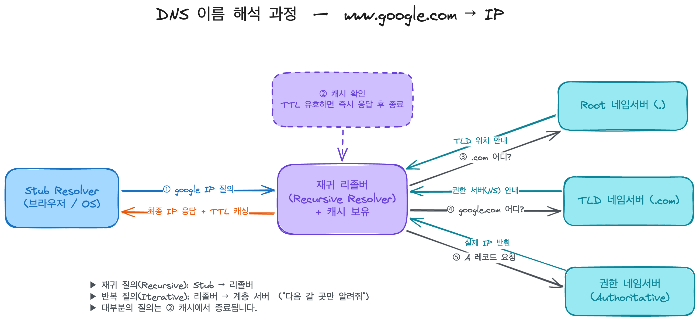

## 어떤 개념일까?

DNS는 사람이 읽는 도메인 이름을 IP 주소로 바꿔주는 분산,계층 데이터베이스이자 그 변환을 수행하는 프로토콜이다.

RFC 1034, RFC 1035에 설명 되어 있고, 지금까지 확장되고 있다.

트리 구조의 이름 공간을 갖고 여러 주체가 나눠서 관리하고, 
각 영역의 권한을 가진 서버가 자기 영역의 정보만 책임진다.

저장되는 단위는 레코드이고, 타입 별로 역할이 다르다.

| 레코드     | 역할                 |
| ------- | ------------------ |
| `A`     | 도메인 → IPv4 주소      |
| `AAAA`  | 도메인 → IPv6 주소      |
| `CNAME` | 도메인 → 다른 도메인(별칭)   |
| `NS`    | 이 영역을 책임지는 네임서버 지정 |
| `MX`    | 메일 서버 라우팅          |

---

## 어떤 문제를 해결하려고 나왔을까? 왜 사용 할까?

초기에는 모든 호스트 이름 ↔ 주소 매핑을 하나의 중앙에서 배포하였다.

3가지 다음 문제가 존재하였다.

- 확장성: 단일 파일 관리 불가능
- 갱신 부담: 누군가 변경하면 전 세계 파일을 다시 받아야 함
- 단일 장애점/ 병목: 중앙 한 곳에서 모든 트래픽과 책임이 집중

DNS는 이를 계층적 위임 + 분산 + 캐싱으로 풀어냈다.

서비스가 뒤에서 IP를 바꾸어도(서버 교체, 로드밸런서, 마이그레이션) 도메인 이름은 그대로 유지된다.

---

## 어떻게 동작하나?

### Stub resolver

브라우저에 내장된 질의기

### Recursive resolver 재귀 리졸버

공용 DNS이고 캐시를 들고 있고 계층에 따라 반복적인 질의를 수행한다.

### Root / TLD / Authoritative 네임 서버

각 계층을 책임 지는 권한 서버

### 단계별 순서

1. `Stub Resolver`가 `www.google.com` 도메인의 IP를 재귀 리졸버에게 묻는다.
2. 재귀 리졸버는 먼저 자기 캐시를 확인한다.
TTL이 안지난 답이 있다면 끝
3. 캐시에 존재하지 않는다면 반복 질의를 시작한다.
Root에게 먼저 묻고,
Root는 `.com` 은 저쪽 TLD 서버한테 물어봐라며 위치를 알려준다.
4. TLD(`.com`) 서버에게 묻고, `google.com` 의 권한 서버는 여기야라고 NS 정보를 받는다.
5. 권한 네임 서버에게 물어보고 A 레코드(실제 IP)를 받고, 이 답을 TTL과 함께 캐싱한 뒤 Stub Resolver에게 돌려준다.

---

## 언제 쓰고, 언제 안 쓰나?

### 쓸 때:

도메인 기반으로 통신하는 경우 거의 사용한다.

- 웹 서비스
- API 호출
- 메일

### 안 쓸 때:

---

## 남에게 설명한다면 어떻게 설명할 것인가?

---

## 추가 궁금한 질문들

- Route53도 도메인 기반인데 이건 어떻게 작동되나?
- 재귀 리졸버와 권한 네임서버는 **캐싱 정책**에서 어떻게 갈리나? (권한 서버는 원본 source of truth, 재귀는 TTL 기반 사본)
- TTL을 너무 짧게/길게 잡으면 각각 어떤 비용이 생기나? 
(조회 부하 vs. 변경 전파 지연 무중단 배포·DNS 기반 페일오버와 직결)
- `CNAME` 체인이 길어지면 해석 성능에 어떤 영향이 있나?
- DNSSEC는 무엇을 보장하고(무결성·인증) 무엇은 안 하나(기밀성은 DoH/DoT 영역)?
- 라운드로빈 DNS / 지연 기반 라우팅 같은 **DNS 레벨 로드밸런싱**은 어디까지 책임지고 어디서 한계가 오나?
- JVM `networkaddress.cache.ttl`과 OS 리졸버 캐시가 겹칠 때, 실제 IP 변경이 애플리케이션에 반영되기까지의 경로는?

---

## Route53

맨 아래 권한 네임 서버를 AWS가 대신 운영해주는 관리현 DNS 서비스이다.

도메인 등록, 라우팅, 헬스 체크까지 지원해준다.

도메인의 NS 레코드를 Route53 네임 서버를 가리키도록 위임하면, 재귀 리졸버가 반복 질의 마지막 단계에서 Route53에게 A 레코드를 물어보게 된다.

## 어떤 문제를 해결하려고 나왔을까?

권한 네임 서버를 직접 운영하려면 여러가지 가용성, 보안 등등을 다 책임져야 한다.

Route53은 이러한 운영 부담을 걷어내고, 평범한 권한 서버가 못하는 두가지를 더 해결해준다.

