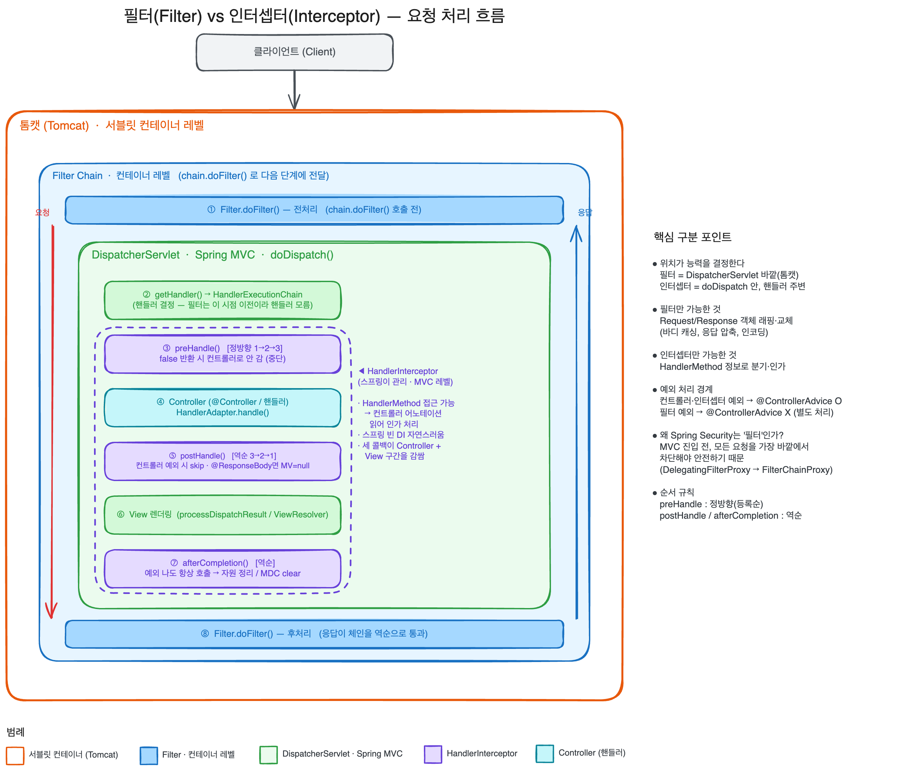

## 어떤 개념일까?


### Filter vs Interceptor


둘은 둘다 요청을 가로채는 공통의 관심사 분리 도구이지만,
필터는 서블릿 컨테이너 레벨에서 DispatcherServlet `바깥`을 감싸고,
인터셉터는 스프링 MVC 레벨에서 DispatcherServlet `안쪽` 핸들러 호출 주변을 감싼다.
동작하는 위치가 다르기 때문에 할 수 있는 것과, 용도가 다르다.


그래서 할 수 있는 것과 어떤 용도가 다를까?


둘다 공통점이라고 하면 컨트롤러에 도달하기 전/후로 요청을 가로채서 인증, 로깅, 인코딩과 같은 횡당 관심사를 처리한느 장치이지만,
누가 관리하느냐 어떤 레벨이냐에 따라 다르다고 생각한다.


| 구분                            | 필터 (Filter)                                       | 인터셉터 (HandlerInterceptor)                                        |
| ----------------------------- | ------------------------------------------------- | ---------------------------------------------------------------- |
| 정의 출처                         | 서블릿 표준 스펙 (`jakarta.servlet.Filter`)              | 스프링 MVC (`org.springframework.web.servlet.HandlerInterceptor`)   |
| 관리 주체                         | 서블릿 컨테이너 (톰캣)                                     | 스프링 컨텍스트 (DispatcherServlet)                                     |
| 동작 위치                         | DispatcherServlet **앞** (요청이 스프링에 진입하기 전)         | DispatcherServlet **안**, 핸들러(컨트롤러) 호출 직전/직후                      |
| 핸들러 정보                        | 모름 (아직 어떤 컨트롤러가 처리할지 결정 전)                        | 앎 (`HandlerMethod`를 인자로 받음 → 어떤 컨트롤러 메서드인지, 어떤 어노테이션 붙었는지 접근 가능) |
| Request/Response 교체           | **가능** (Wrapper로 감싸서 객체 자체를 바꿔치기)                 | 불가능 (흐름 제어만, 객체 교체는 못 함)                                         |
| 등록 방법                         | `FilterRegistrationBean`, `@WebFilter`, `web.xml` | `WebMvcConfigurer.addInterceptors()`                             |
| 스프링 예외처리(`@ControllerAdvice`) | 적용 **안 됨** (스프링 바깥이라)                             | 적용 됨 (스프링 안이라)                                                   |


---


## 어떤 문제를 해결하려고 나왔을까? 왜 사용 할까?


모든 컨트롤러마다 인증 체크, 로깅, 인코딩 처리 코드를 중복해서 넣게 되는 상황이 생길 수 있다.
이러한 공통적인 관심사를 비즈니스 로직에서 떼어내고 한곳에서 관리하기 위해서 사용한다.

- 중복 제거: 모든 컨트롤러에서 분리하여 관심사를 한번에 하나씩 처리하여 중복을 없앤다.
- 관심사 분리: 컨트롤러는 예약을 생성한다는 비즈니스에만 집중하고, 다른 관심사에서는 필터와 인터셉터에서 다르게 관심사를 관리한다.
- 그럼 왜 둘로 나뉘었을까?: 처리하려는 관심사가 스프링 컨텍스트/핸들러 정보를 필요로 하느냐에 따라 갈린다.
    - 인코딩, CORS, 보안 처럼 스프링과 무관하게 모든 요청에 적용되어야 하고, 요청 객체 자체를 손봐야 한다면, 필터가 적합하다.
    - 이 컨트롤러 메서드에 @Auth가 붙었는지 보고 인증 검사 처럼 핸들러의 메타 정보가 필요하다면 인터셉터가 적합하다.

---


## 어떻게 동작하나?


### 전체적인 흐름도





### Filter의 동작 원리 - 책임 연쇄


```java
public class MyFilter implements Filter {
    @Override
    public void doFilter(ServletRequest req, ServletResponse res, FilterChain chain)
            throws IOException, ServletException {
        // ── 전처리: 다음으로 넘기기 전 ──
        // chain.doFilter()를 호출해야 다음 필터(또는 DispatcherServlet)로 넘어간다.
        chain.doFilter(req, res);
        // ── 후처리: 응답이 돌아온 뒤 ──
    }
}
```


다 처럼 책임 연쇄 과정 원리가 핵심이다.

- chain.doFilter() 호출을 통해서 다음 단계로 넘어가고,
호출을 안하면 거기서 요청이 끊긴다.
- chain.doFilter() 호출 전 코드는 들어가는 길에, 후 코드는 응답이 돌아오는 길에 실행이 된다.
즉, 한 메서드 안에 전/후 코드가 들어있다.
- Request/Response 교체가 가능하다.
    - 요청과 응답을 하나의 Wrapper로 감싼 객체로 넘길 수도 있고,
    - 요청 바디를 여러번 읽게 캐싱하거나,
    - 응답 압축을 하는등 여러가지가 가능하다.
- 생명 주기: init() → doFilter() → destroy()

### Interceptor의 동작 원리 - 3개 콜백


인터셉터는 한 메서드가 아니라 시점이 분리된 3개 메서드로 동작한다.
DispatcherServlet의 doDispatch() 흐름이랑 연결된다.


```java
public interface HandlerInterceptor {
    // 컨트롤러 호출 "직전". false 반환 시 요청 중단(컨트롤러로 안 감)
    boolean preHandle(HttpServletRequest req, HttpServletResponse res, Object handler);

    // 컨트롤러 호출 "직후", View 렌더링 "전". ModelAndView를 손볼 수 있다.
    void postHandle(..., ModelAndView modelAndView);

    // View 렌더링까지 "다 끝난 후". 예외(ex)를 인자로 받음 → 자원 정리/로깅용
    void afterCompletion(..., Exception ex);
}
```


#### DispatcherServlet.doDispatch() 안에서 Interceptor의 메서드 호출 순서도

1. getHandler()에서 핸들러와 인터셉터들을 가져오고
2. applyPreHandle() → preHandler() 등록 순서대로 실행
3. HandlerAdapter.handler() → 컨트롤러 실행
4. applyPostHandler() → postHandler() 등록의 역순으로
5. processDispatchResult() →View 렌더링
6. triggerAfterCompletion → afterCompletion() 등록의 역순으로 실행

---


## 언제 쓰고, 언제 안 쓰나?


### 필터를 쓸 때

- **스프링 컨텍스트와 무관하게** 모든 요청에 적용해야 할 때 (정적 리소스 포함).
- **Request/Response 객체 자체를 가공**해야 할 때: 문자 인코딩(`CharacterEncodingFilter`), 요청 바디 캐싱, 응답 압축(gzip).
- **보안 차단**: 스프링 시큐리티 필터 체인.
- **요청 전체에 걸친 추적 컨텍스트 설정**: TraceId/MDC 세팅. → 필터에서 MDC에 traceId를 넣으면, 그 뒤 인터셉터·컨트롤러·심지어 필터 레벨 로깅까지 전 구간에서 같은 traceId가 찍힌다. (인터셉터에 넣으면 필터 구간 로그엔 안 찍힘)

### 인터셉터를 쓸 때

- **핸들러(컨트롤러) 정보가 필요할 때**: 컨트롤러 메서드의 커스텀 어노테이션(`@LoginRequired` 등)을 읽어 인가 처리.
- **스프링 빈을 주입받아 써야 할 때**: 인터셉터는 스프링 빈이라 DI가 자연스럽다. (필터도 스프링 빈으로 등록하면 되지만, 본질적으로 컨테이너 소속)
- **핸들러 실행 전후의 비즈니스 흐름 제어**: 실행 시간 측정, 핸들러별 로깅, 공통 모델 속성 추가.

---


## 남에게 설명한다면 어떻게 설명할 것인가?


---


## 추가 궁금한 질문들

1. **인터셉터 여러 개일 때** **`postHandle`****이 역순인 이유는?** → 양파 구조상 자연스럽지만, 이걸 의식하지 않으면 순서 의존 로직에서 버그가 난다. 실제로 순서가 문제 된 경험을 만들어볼 것(의도적 파괴).
2. **`@ResponseBody`****에서** **`postHandle`****이 무력한 정확한 이유**는? `RequestResponseBodyMethodProcessor`가 반환값을 언제 메시지 컨버터로 쓰는지(`HandlerAdapter.handle()` 내부) 추적해보기.
3. **필터에서 던진 예외를 일관되게 처리하려면?** `@ControllerAdvice`가 못 잡으니, 별도 에러 처리 필터를 가장 바깥에 두거나, 에러 디스패치(`/error`)로 보내는 방식 비교.
4. **`OncePerRequestFilter`****가 막는 '중복 실행'은 구체적으로 언제 발생**하나? (`RequestDispatcher.forward()`, 비동기 디스패치, `ERROR` 디스패치) — 실제로 forward를 발생시켜 필터가 두 번 타는지 로그로 확인.
5. **스프링 시큐리티** **`FilterChainProxy`****는 어떻게 톰캣 필터 체인과 스프링 빈 사이를 잇나?** → `DelegatingFilterProxy`의 위임 구조.
6. **인터셉터를 스프링 빈으로 등록해 DI 받는 것 vs 필터를** **`FilterRegistrationBean`****으로 등록하는 것**의 실질 차이는? (둘 다 빈이 될 수 있는데 왜 소속 레벨을 구분하는가)
7. **traceId를 필터에 넣었을 때 비동기(****`@Async`****,** **`WebClient`****) 구간으로 MDC가 전파 안 되는 문제** — 이건 필터/인터셉터 위치 문제와 별개로 스레드 경계 문제. 어디서 끊기는지.

