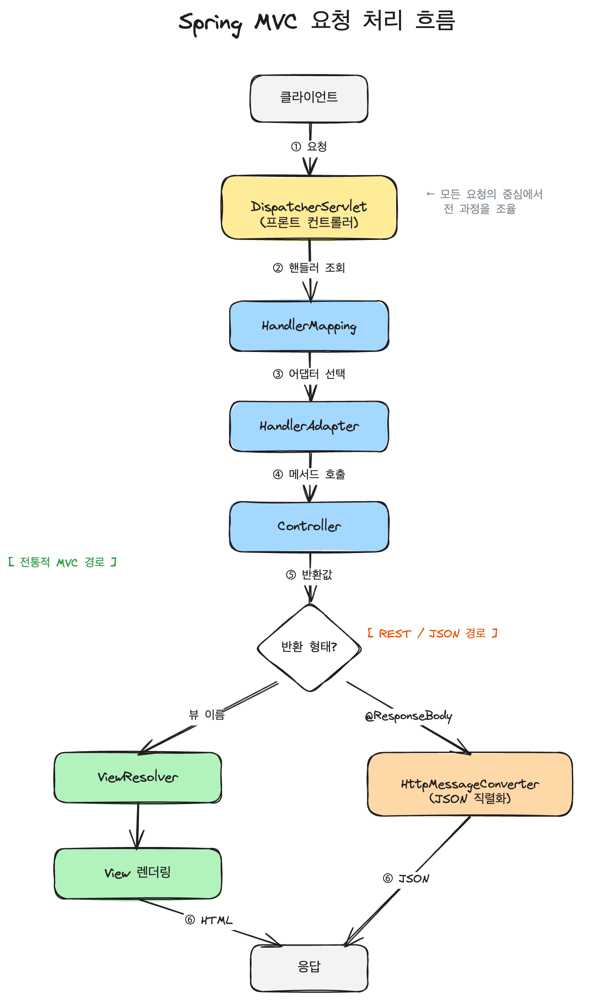

## 어떤 개념일까?

### Spring MVC의 흐름 

Spring MVC에서 핵심은 `DispatcherServlet`을 기준으로 흐름을 보는게 중요하다고 생각합니다.

1. 요청 수신: `DispatcherServlet`으로 클라이언트 요청이 들어온다.
2. 핸들러 조회: `HandlerMapping`이 요청 url에 맞는 컨트롤러를 찾아준다.
3. 핸들러 실행: `HandlerAdapter`가 해당 컨트롤러를 실행한다. 이때 `ArgumentResolver`가 파라미터를 바인딩
4. 분기: 컨트롤러의 반환 형태에 따라 `ReturnValueHandler`에 의해 분기 된다.
5. 뷰 처리: `ViewResolver`가 뷰 이름을 실제 `View`로 변환하고, `View`가 모델을 렌더링한다.
6. REST 경로: `HttpMessageConverter`가 반환 객체를 JSON으로 직렬화후 body에 작성한다.
7. 응답 전송: 최종 렌더링 결과를 클라이언트에 응답한다.

크게 이렇게 6개로 볼 수 있을거 같습니다.

---

## 어떤 문제를 해결하려고 나왔을까? 왜 사용 할까?

---

## 어떻게 동작하나?

---

## 언제 쓰고, 언제 안 쓰나?

### 쓸 때:

### 안 쓸 때:

---

## 남에게 설명한다면 어떻게 설명할 것인가?

---

## 추가 궁금한 질문들

