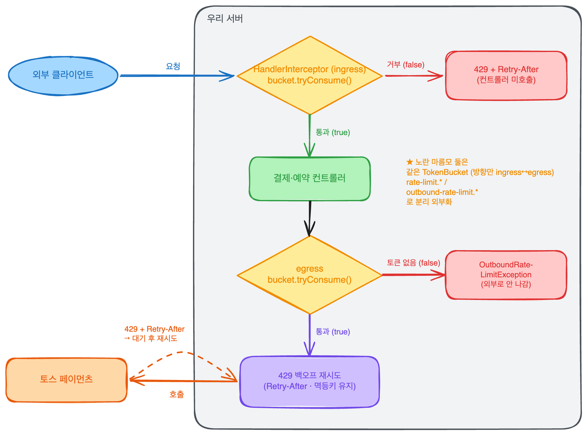

Rate Limit는 초당 N건이라는 정책을 토큰 버킷 하나로 구현을하고,
같은 알고리즘으로 들어오는 요청과 나가는 호출에 방향만 바꿔서 적용하는 것이다.


## 어떤 개념일까?


AI를 이용해 핵심 개념을 빠르게 파악한다.
깊은 이해보다는 새로운 기술이 어떤 기술인지 어떤 문제를 해결하기 위해 등장했는지 지도만 그린다.
공식문서 docs를 기반으로 신뢰 있는 개념 정보를 추출한다.


### TPS란?


Transactions Per Second로 초당 처리할 수 있는 트랜잭션 수이다.
측정값의 의미를 갖고 있고, 얼마나 처리 됬나 알 수 있다.


### Rate Limit란?


초당 N건까지 허용한다는 한계 정책이다.


이전에 타임아웃으로 느린 호출을 끊어서 TPS를 지키는 것으로 보았다면,
Rate Limit를 통해 정책으로 TPS를 지킨다.


### 토큰 버킷이란?

- `capacity`: 버킷에 차있을 수 있는 최대 토큰 수, 허용 버스트
- `refillPerSec`: 매초 보충되는 토큰 수, 평균 TPS 상한
- 요청은 토큰 1개를 소비하고, 토큰이 없으면 거부된다.

서버는 같은 Rate Limit를 양쪽 방향에서 보게된다.

- 들어오는쪽으로 요청이 몰리면 초과분을 429 코드로 거부한다.
- 나가는쪽으로 토스를 호출할 때 상대 한도를 넘지 않도록 호출량 조절
- 429 Too Many Request는 RFC 6585 클라이언트가 정해진 시간 동안 너무 많은 요청을 보냈을 때 마주하게 된다.
- Retry-After 헤더는 RFC 9110에서 이만큼을 기다렸다가 다시와 라는 뜻으로, 초 날짜로 표현해준다.
- `HandlerInterceptor`, `ClientHttpRequestInterceptor`는 Spring에서 공식 문서상 각각 들어오는 요청 전처리와 나가는 요청 가로채기의 표준을 제공해준다.

---


## 어떤 문제를 해결하려고 나왔을까? 왜 사용 할까?

- 서버 입장에서 생각해보면 처리할 수 있는 용량을 넘는 요청이 많아졌을 때, 이를 제한하면서 예방하기 위해서이다.
컨트롤러 DB까지의 일이 흘러가서 전체적으로 느려지거나 서버가 죽을 가능성이 있다.
- 클라이언트 입장에서 상대 즉 토스가 우리에게 허용하는 몫을 초과하는 상황을 예방하기 위해서이다.
토스가 어차피 429 예외로 거부가 되기 때문에, 불필요한 호출이 될거고, 재시도 불필요한 비용이 발생하게 될 것이다.

---


## 어떻게 동작하나?





### 토큰 버킷 알고리즘

- `보충량` = refillPerSec X 마지막 보충 이후 경과 시간
- `tryConsume()`:
    - 토큰이 1보다 크면 1개 소비하고 통과,
    - 토큰이 없으면 거부
- `retryAfterSeconds()`
    - 토큰 1개가 찰 때까지 필요한 초를 ceil 반올림해서 반환한다.

시간 로직은 System.nanoTime으로 하지 않고, LongSupplier로 가짜 시계를 통해서 결정적인 테스트를 진행한다.


동시 요청에서도 정확하게 capacity 개수만큼 통과하도록 동시성에 안전하게 처리한다.


### 요청이 들어오는 쪽 `HandlerInterceptor`


```java
preHandle():
  if (bucket.tryConsume()) return true;            // 통과 → 컨트롤러 호출
  response.status = 429;
  response.header("Retry-After", bucket.retryAfterSeconds());
  return false;                                    // 컨트롤러 호출 안 함
```


preHandle()에서


만약 버킷이 tryConsume()이 통과되면 컨트롤러 호출하고,
통과 못했으면, 응답 헤더에 Retry-After로 재시도 시작을 버킷에서 가져와 반환한다.


이때, capatity와 refillPerSec는 rate-limit.*로 외부화한다.
코드 수정 없이 거부 시점에 변경한다.


### 나가는 쪽 


`ClientHttpRequestInterceptor` 


응답이 429이고, 시도가 maxAttempts보다 작으면,
Retry-After초 만큼 대기 후에 재시도 하고, 없으면 고정으로 1초 폴백


시도 ≥ maxAttempts 인데도 429이라면,
도메인 예뢰로 실패처리하면서 무한 재시도를 방지한다.


재시도는 2단계의 주문당 고정 멱등키를 유지한 채 보낸다.


429는 아직 처리되지 않았기 때문에 다시 보내도 괜찮지만,
read timeout처럼 처리가 됬는지 모르기 때문데, 중복 승인을 막기 위해서 멱등키를 유지해야한다.


`OutboundRateLimit`


```java
호출 전:
  if (!outboundBucket.tryConsume())
      throw OutboundRateLimitException;            // 외부로 보내지 않음(fail-fast)
```


위에서 들어오는 것과 똑같은 `TokenBucketRateLimiter` 를 재사용한다.


나가는 한도는 outbound-rate-limit.*로 들어오는쪽과 분리하여 외부화한다.


게이트웨이에 RestClient에 인터셉터를 추가하고,
나가는 호출을 한 곳에서 Rate Limit + 백오프를 같이 관리한다.


---


## 언제 쓰고, 언제 안 쓰나?


### 쓸 때:

- 처리 용량을 넘는 요청을 앞단에서 잘라야할때 ingress
- 상대가 정한 호출 한도를 넘지 않도록 호출량을 조절해야할 때 egress
- 순간 버스틑 허용하되, 평균은 제한하고 싶을 때 토큰 버킷을 사용한다.

### 안 쓸 때:

- 느린 호출의 경우는 타임아웃의 단계에서 조절해야한다.

---


## 추가 궁금한 질문들


**Q1.** **`capacity`** **vs** **`refillPerSec`****를 키우면?**


`capacity`↑ → **순간 버스트** 허용폭이 커진다(한꺼번에 받을 수 있는 양). 
`refillPerSec`↑ → **평균 처리량**이 올라간다. 둘은 직교한다. 
버스트는 받되 평균은 낮게(`capacity` 크고 `refill` 작게) 같은 조합


**Q2. 들어오는 한도 = 나가는 한도로 두면 안 되는 이유?**


들어오는 한도는 **우리 처리 용량**, 
나가는 한도는 **상대가 우리에게 허용한 몫**이다. 출처가 다르다. 
우리가 초당 100건 처리할 수 있어도 토스가 초당 20건만 허용하면 egress는 20이어야 한다. 같은 값으로 묶으면 둘 중 하나는 반드시 틀린다.
→ 그래서 `rate-limit.*`와 `outbound-rate-limit.*`를 **분리 외부화**.


**Q3. egress를 fail-fast(즉시 거부) 대신 블로킹 대기로 하면?**

- 대기 방식: 호출을 매끄럽게 흘려보내 거부가 줄지만,
**스레드를 붙잡고**(자원 점유) **결정적 테스트가 어렵다**(시간에 의존).
- fail-fast: 자원을 안 잡고 테스트가 결정적이지만,
호출자가 거부를 직접 처리(재시도/백프레셔)해야 한다.
- 이번 미션은 fail-fast(`OutboundRateLimitException`)를 택했다.
테스트 결정성과 자원 안전성이 이유.

**Q4. read timeout 재시도(2단계) vs 429 재시도는 뭐가 다른가?**

- **read timeout**: "이미 처리됐을 수 있음" 
→ 그냥 재시도하면 **중복 승인 위험**. 멱등키가 그래서 필수적으로 안정장치가 필요하다.
- **429**: "아직 처리 안 됨" 
→ 재시도 자체는 안전하지만. 
다만 `Retry-After` 처리 + 멱등키 유지로, 
둘을 한 경로(같은 멱등키)로 통일해 어느 실패 유형이든 중복을 예방한다.
- 결론: 두 재시도의 안전성 근거는 다르지만(멱등성 ↔ 미처리), 
멱등키를 항상 유지하면 두 경우를 한 코드로 안전하게 덮는다.

**Q5. Rate Limit vs 서킷 브레이커?**

- Rate Limit = **양(throughput) 제어**. "정상이어도 너무 많으면 막는다."
- 서킷 브레이커 = **연속 실패 차단**. 
양과 무관하게, 상대가 계속 죽으면 호출 자체를 끊어 빠르게 실패시키고 회복을 기다린다.
- 보완 관계: Rate Limit으로 평소 양을 평탄화하고, 
그래도 상대가 연쇄 실패하면 서킷 브레이커로 끊는다. 
다음 단계로 자연스럽게 이어질 주제.

**더 딥다이브 할 수 있는 것**

- 동시성 구현을 `synchronized` vs `AtomicLong`/CAS 중 무엇으로? 
정확히 capacity개 통과를 어떻게 증명할까(CountDownLatch로 동시 요청 재현).
- ingress 버킷이 **인스턴스 로컬**이면 다중 인스턴스에서 전체 한도가 N배로 새는데,
분산 환경에선 어떻게(중앙 버킷 vs 인스턴스별 한도 분배) 할까?
- `Retry-After`가 HTTP-date 형식으로 올 때(초가 아니라 날짜)의 파싱 분기는?

