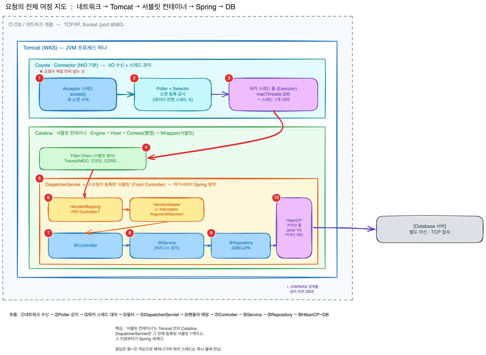
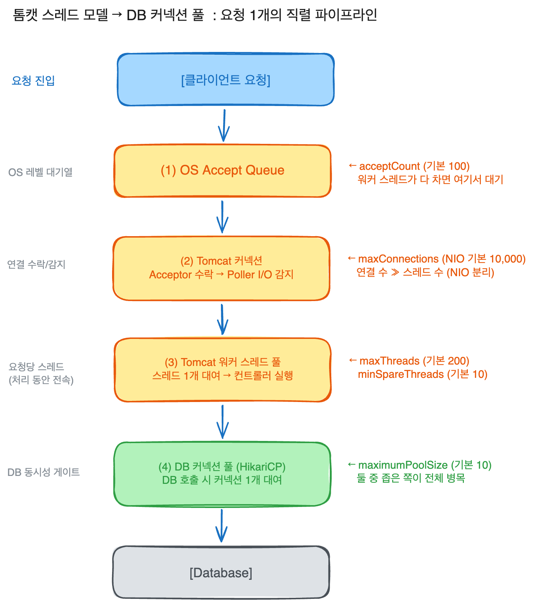
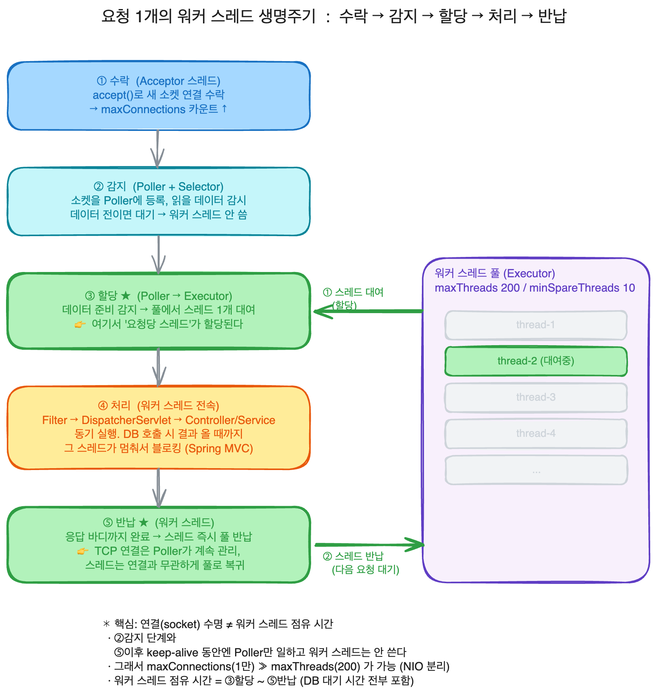

## 어떤 개념일까?

먼저 전체적인 요청에 대한 흐름 그림은 다음과 같다.

### 톰캣 스레드 모델과 커넥션 풀까지

요청1개가 들어왔을 때 어디서 스레드를 받아 처리되고 어떻게 반환이 되는지,
그 스레드가 DB 커넥션과 어떻게 연결이 되는지 이해한다.

결론부터 하가면, 톰캣은 요청 하나당 워커 스레드 하나를 빌려줬다가 처리가 끝나면 다시 풀에 반납하는 구조이다.
근데 그 스레드가 DB를 호출하게 되면 이번엔 커넥션 풀에서 커넥션 하나를 또 빌린다.
즉, 요청은 두 개의 풀 (스레드 풀  → 커넥션 풀)을 순서대로 통과하는 흐름이고,
둘 중 더 좁은 쪽의 풀이 전체 처리량의 병목이 되게 된다.

#### Thread-per-request

기본적으로 요청 하나를 처리하는 동안 워커 스레드 하나가 그 요청을 맡는다.
응답을 다 쓰기 전까지 그 스레드는 다른 요청을 못 받는다.

#### NIO Connector

Tomcat의 기본 개념으로 소켓 수락과 I/O감지를 워커 스레드와 분리한다.
이 덕분에 연결과 처리의 개수가 분리될 수 있다.

#### Connection Pool

HikariCP처럼 미리 만들어준 DB 커넥션을 빌려주고 반납받는 재사용의 창고로 사용되고,
커넥션 생성은 비싸기 때문에 매번 만들지 않고 관리한다.

---

## 어떤 문제를 해결하려고 나왔을까? 왜 사용 할까?

### 스레드 풀

매요청마다 스레드 생성 비용을 제거하기 위한 목적이다.
스레드는 생성/소멸의 비용이 크고, 무한정 만들게 되면 메모리와 컨텍스트 스위칭으로 서버가 위험하다.
그래서 미리 정해진 수의 스레드를 만들고 재사용하게 되었다.

### NIO Connector

이전 톰캣 모델은 연결1개에 스레드1개가 계속 점유했지만, 계속 연결만 연어두게 된다면
놀게되는 클라이언트가 많아지고 스레드가 전부 대기중인 빈 연결에만 묶여있게 되어 낭비가 된다.

그래서 NIO는 Poller가 다수의 연결을 Selector로 감시하다가,
실제 데이터가 들어온 순간에만 워커 스레드를 배정한다.
그래서 만 개의 연결을 200개의 스레드로 감당할 수 있게 된다.

### 커넥션 풀

DB 커넥션 1개는 DB와의 메모리, 프로세스, 인증 상태를 잡고 있게 된다.
또한 DB와의 최대 커넥션 수는 `max_connections` 로 유한하다.

그래서 풀로 커넥션들을 재사용하고, 동시에 풀의 크기가  DB에 동시에 던질 수 있는 쿼리 수의 상한선 즉,DB와의 연결과 게이트의 역할을 하여 DB와 과도한 동시성으로 무너지지 않도록 도와준다.

HikariCp의 핵심 철학은 유저 스레드는 오직 풀 자체에서만 대기하고,
커넥션 생성에서 대기하면 안된다. 그래서 고정 크기 풀을 권장한다고 한다.

---

## 어떻게 동작하나?

### 스레드는 어디서 할당되고, 언제 어디서 반환이 될까

요청 하나가 들어온다면 다음과 같은 흐름으로 진행이된다.

1. `수락`: Acceptor 스레드가 accept()로 새로운 소켓을 연결 받는다.
이 단계에서 maxConnections 카운트가 올라간다.
2. `감지`: 연결 받은 소켓을 Poller에 등록한다.
Poller는 Selector로 이 소켓에 읽을 데이터가 왔는지를 감시한다.
데이터가 아직오지 않았다면 여기서 머물고 워커 스레드는 사용하지 않는다.
3. `할당`: Poller가 읽을 데이터가 준비됬다는 상태를 감지한다면,
워커 스레드 풀 (Executor)에서 스레드 1개를 꺼대서 그 요청에 배정한다.
`여기서 요청당 스레드가 할당된다.`
4. `처리`: 그 워커 스레드가 Filter → DispatcherServlet → 에서 
해당 요청의 Controller, Service 코드를 동기적으로 끝까지 실행한다.
Spring MVC는 여기서 블로킹 모델이기 때문에, 이 안에서 DB를 호출하면
그 워커 스레드가 결과 올 때까지 멈춰서 기다린다.
5. `반환, 반납`: 응답 바디까지 요청 처리가 끝나게 된다면,
워커 스레드는 즉시 풀에서 반납되어 다음 요청을 받을 준비를 한다.
TCP 연결 자체는 열려 있을 수 있다.
연결은 Poller가 관리하기 때문에, 워커 스레드는 연결과 무관하게 풀로 돌아간다.

### DB 커넥션 풀과 스레드 풀은 어떤 관계가 있을까

워커 스레드가 4단계에서 DB를 호출하는 순간

1. 워커 스레드가 HikariCP 풀에 커넥션 1개 요청
2. 놀고 있던 커넥션이 있으면 빌려준다.
없다면 워커 스레드는 connectionTimeout (기본 30초) 동안 풀 앞에서 블로킹 대기 한다.
3. 30초 동안 못 받으면 `SQLTransientConnectionException` 을 던지며 요청 실패
4. 쿼리가 끝다면 커넥션 풀에 반납한다.
5. 워커 스레드는 응답을 마치고 자기 풀로 반납

두 풀은 크기의 불균형이 만드는 병목이 중요하다.

- maxThread = 200 (톰캣 워커 스레드)
- maximumPoolSize = 10 (HikariCP 커넥션, 기본값)

여기서 DB가 필요한 요청이 동시에 200개 들어온다면?
10개의 커넥션을 잡고 일하고,
나머지 190개는 워커 스레드는 커넥션 기다림 상태로 블로킹한다.
응답이 느려지고 타임아웃으로 실패한다.
이는 병목이 아니라 커넥션 대기 시간이다.

#### 그럼 커넥션 풀을 크게 하면 가능할까?

답은 아니다.
커넥션이 CPU 코어수를 넘어가면 DB 안에서 컨텍스트 스위칭, 락 경함으로 오히려 느려지게 된다.
HikariCP 에서 오히려 풀 크기를 줄였더니 응답이 100ms → 2ms로 50배 빨라졌다는 결과가 있다.

HikariCP 권장 커넥션

> connections = (CPU 코어 수 X 2) + 디스크 스핀들 수  
>   
> 예) 4코어 + 네트워크 DB 1   
> → (4x2) + 1 = 10

여러개의 인스턴스를 띄운다면 인스턴스 수로 총량을 분배한다.

---

## 언제 쓰고, 언제 안 쓰나?

### 쓸 때:

### 안 쓸 때:

---

## 남에게 설명한다면 어떻게 설명할 것인가?

---

## 추가 궁금한 질문들

### **`톰캣 스레드 풀의 채워지고 넘치는 규칙`**

1. **NIO vs NIO2 vs APR**: 셋의 I/O 처리 방식 차이는? 왜 8.5부터 BIO가 사라졌나? (Acceptor/Poller 모델을 코드 레벨에서 추적)
2. **Spring MVC(블로킹) vs WebFlux(논블로킹)**: WebFlux는 적은 스레드로 많은 요청을 처리한다는데, 그럼 "요청당 스레드" 모델이 깨지는 건가? 이때 DB 호출은 어떻게 처리되나(R2DBC)?
3. **Virtual Thread (Java 21, Loom)**: 가상 스레드를 톰캣 워커에 쓰면 maxThreads 제약이 사라지나? 그럼 병목은 자동으로 커넥션 풀로 옮겨가는가? (Spring Boot 3.2+ `spring.threads.virtual.enabled`)
4. **두 풀의 정합성 튜닝**: 내 프로젝트에서 maxThreads와 maximumPoolSize를 어떤 근거로 맞춰야 하나? `pending connections` 지표를 어떻게 관측하지?
5. **트랜잭션과 커넥션 점유 시간**: `@Transactional` 메서드 안에서 외부 API를 호출하면 왜 위험한가? (커넥션을 잡은 채로 네트워크 대기 → 풀 고갈) — 이건 내가 정리했던 "트랜잭션에서 외부 API 제외" 규칙과 직결됨.
6. **acceptCount를 넘으면**: "connection refused"가 클라이언트엔 어떻게 보이고, 로드밸런서/리트라이 폭풍과 어떻게 연쇄 장애로 번지나?
7. **maxLifetime 함정**: HikariCP `maxLifetime`이 DB의 `wait_timeout`보다 길면 왜 "월요일 아침 stale connection 에러"가 나나?

