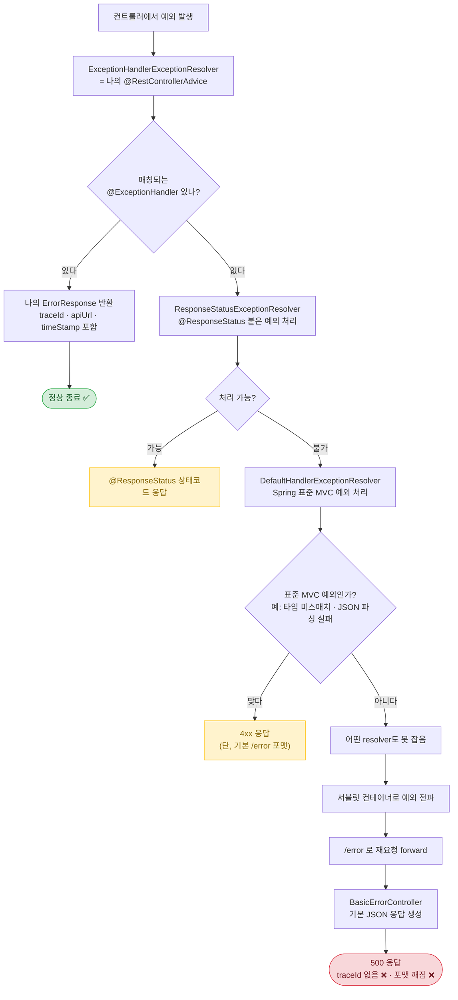

# 💥 의도적 파괴 학습 로그


**개념 / 대상 코드:**


```java
package roomescape.global.exception;

@RestControllerAdvice
public class GlobalExceptionHandler {

    @ExceptionHandler(IllegalArgumentException.class)
    public ResponseEntity<ErrorResponse> handleIllegalArgumentException(
            IllegalArgumentException illegalArgumentException, HttpServletRequest httpServletRequest
    ) {
        ErrorResponse errorResponse = new ErrorResponseBuilder()
                .httpStatus(HttpStatus.BAD_REQUEST)
                .errorMessage(illegalArgumentException.getMessage())
                .apiUrl(httpServletRequest.getRequestURI())
                .timeStamp(LocalDateTime.now())
                .traceId(MDC.get("traceId"))
                .build();

        return ResponseEntity.status(errorResponse.httpStatus()).body(errorResponse);
    }

    @ExceptionHandler(CustomException.class)
    public ResponseEntity<ErrorResponse> handleCustomException(
            CustomException customException, HttpServletRequest httpServletRequest
    ) {
        ErrorResponse errorResponse = new ErrorResponseBuilder()
                .httpStatus(customException.getErrorCode().getHttpStatus())
                .errorMessage(customException.getErrorCode().getMessage())
                .apiUrl(httpServletRequest.getRequestURI())
                .timeStamp(LocalDateTime.now())
                .traceId(MDC.get("traceId"))
                .build();

        return ResponseEntity.status(customException.getHttpStatus()).body(errorResponse);
    }

    @ExceptionHandler(MethodArgumentNotValidException.class)
    public ResponseEntity<ErrorResponse> handleMethodArgumentNotValidException(
            MethodArgumentNotValidException methodArgumentNotValidException, HttpServletRequest httpServletRequest
    ) {
        ErrorResponse errorResponse = new ErrorResponseBuilder()
                .httpStatus(HttpStatus.BAD_REQUEST)
                .errorMessage("요청값이 잘못됐습니다.")
                .apiUrl(httpServletRequest.getRequestURI())
                .timeStamp(LocalDateTime.now())
                .traceId(MDC.get("traceId"))
                .build();

        return ResponseEntity.status(HttpStatus.BAD_REQUEST).body(errorResponse);
    }


    @ExceptionHandler(ConstraintViolationException.class)
    public ResponseEntity<ErrorResponse> handleConstraintViolationException(
            ConstraintViolationException constraintViolationException, HttpServletRequest httpServletRequest
    ) {
        ErrorResponse errorResponse = new ErrorResponseBuilder()
                .httpStatus(HttpStatus.BAD_REQUEST)
                .errorMessage("요청값이 잘못됐습니다.")
                .apiUrl(httpServletRequest.getRequestURI())
                .timeStamp(LocalDateTime.now())
                .traceId(MDC.get("traceId"))
                .build();

        return ResponseEntity.status(HttpStatus.BAD_REQUEST).body(errorResponse);
    }
}
```


## 어떤 개념인가요?


`@RestControllerAdvice` + `@ExceptionHandler`로 전역 예외를 잡아 일관된 `ErrorResponse`(traceId · apiUrl · timeStamp 포함)로 변환하는 구조.


## 어떤 부분을 의도적으로 파괴할 것인가요?


핸들러에 **등록되지 않은 타입**의 예외를 일부러 던져서, "안 잡힌 예외는 어디로 가는가"를 눈으로 확인한다.


---


## 파괴 목록


### 파괴 1 — 등록되지 않은 예외 던지기


**유형:** 경계 조건 (정상 흐름이 아닌 예외를 핸들러 밖으로 흘려보냄)


**무엇을 바꿨나:** 컨트롤러 메서드에 핸들러가 잡지 않는 예외 한 줄 추가


```java
@GetMapping("/reservations")
public List<ReservationResponse> findAll() {
    throw new IllegalStateException("의도적 파괴"); // 핸들러에 없는 타입
}
```


**예상한 결과:** 내 `ErrorResponse` 포맷으로 500이 내려올 것이다. (traceId도 당연히 있겠지)


**실제 에러 로그:**


```plain text
2026-06-01 14:23:11.482 ERROR 12345 --- [nio-8080-exec-2]
o.a.c.c.C.[.[.[/].[dispatcherServlet]
: Servlet.service() for servlet [dispatcherServlet] threw exception
[Request processing failed: java.lang.IllegalStateException: 의도적 파괴]
with root cause

java.lang.IllegalStateException: 의도적 파괴
    at roomescape.reservation.controller.ReservationController.findAll(...)
    ...
```


클라이언트가 받은 응답:


```json
{
  "timestamp": "2026-06-01T14:23:11.490+00:00",
  "status": 500,
  "error": "Internal Server Error",
  "path": "/reservations"
}
```


**왜 이 에러가 났는가:**


`IllegalStateException`은 내 핸들러에 등록된 4개 타입(`IllegalArgumentException`, `CustomException`, `MethodArgumentNotValidException`, `ConstraintViolationException`) 중 어느 것도 아니고, 그 하위 타입도 아니다.

- `ExceptionHandlerExceptionResolver`에서 매칭 실패
- 다른 resolver도 못 잡음
- 서블릿 컨테이너로 전파 → `/error` 재요청 → `BasicErrorController`가 기본 JSON 생성

내 `ErrorResponse`는 애초에 호출조차 되지 않았다.


**역으로 이해한 것 (원래 이렇게 작성되어야 하는 이유):**


핸들러는 "내가 아는 예외"만 잡는 그물이라, 모르는 예외는 그대로 빠져나가 Spring 기본 포맷으로 떨어진다. 그래서 어디에도 안 걸리는 예외를 마지막에 받는 catch-all `@ExceptionHandler(Exception.class)`가 필요하다. 거기서:

1. 일관된 `ErrorResponse` 포맷 유지
2. traceId 주입
3. `log.error`로 원인 기록
4. 내부 메시지는 숨기고 안전 메시지만 노출

```java
@ExceptionHandler(Exception.class)
public ResponseEntity<ErrorResponse> handleUnexpectedException(
        Exception exception, HttpServletRequest httpServletRequest
) {
    log.error("처리되지 않은 예외 발생 traceId={}", MDC.get("traceId"), exception);

    ErrorResponse errorResponse = new ErrorResponseBuilder()
            .httpStatus(HttpStatus.INTERNAL_SERVER_ERROR)
            .errorMessage("서버 내부 오류가 발생했습니다.") // 내부 메시지 노출 금지
            .apiUrl(httpServletRequest.getRequestURI())
            .timeStamp(LocalDateTime.now())
            .traceId(MDC.get("traceId"))
            .build();

    return ResponseEntity.status(HttpStatus.INTERNAL_SERVER_ERROR).body(errorResponse);
}
```


## 의도적으로 파괴했을 때 결과로 얻은 것

- traceId가 응답에서 끊겼다 → MDC 트레이싱이 정작 500에서 무력화됨을 체감.
- 응답 포맷이 `ErrorResponse`가 아니라 기본 `/error` 포맷이라 API 계약이 깨짐을 확인.
- "잡힌 줄 알았던" 표준 MVC 예외(타입 미스매치, JSON 파싱 실패)도 `DefaultHandlerExceptionResolver`가 4xx로 만들지만 내 포맷이 아님을 알게 됨.

---


## 예외 처리 흐름 (mermaid)





**핵심:** 초록(✅) 끝점에 도달하는 길은 단 하나 내 핸들러가 그 예외 타입을 명시적으로 등록했을 때뿐. 나머지 모든 경로는 노랑(포맷 깨진 4xx)이나 빨강(traceId 없는 500)으로 끝난다. catch-all 핸들러를 추가하면 빨간 끝점으로 가던 흐름을 다시 초록으로 끌어오는 셈.


---


## 발생하는 문제점


### 1. 응답 포맷이 깨진다.


API 계약으로 만들어놓은 ErrorResponse 대신 Spring 기본 JSON이 나간다.


### 2. 상태 코드가 부정확해진다.


500 error로 클라이언트 잘못인데 서버 내부 오류로 보고되어 장애 원인을 파악하기 어려워진다.


### 3. traceId가 끊긴다.


관측성 상실로 인해 클라이언트가 받은 에러와 서버 로그 연결이 사라진다.
MDC 트레이싱을 만든 이유가 정작 필요한 장애 상황에서 무력화된다.


### 4. 내부 정보 노출 위험


server.error.include-stacktrace나 include-message 설정에 따라 스택트레이스 냅주 메시지가 그대로 클라이언트에 세어나갈 수 있다.
즉, SQL이나 패키지 구조 같은 내부 구현이 노출될 가능성이 높다.


