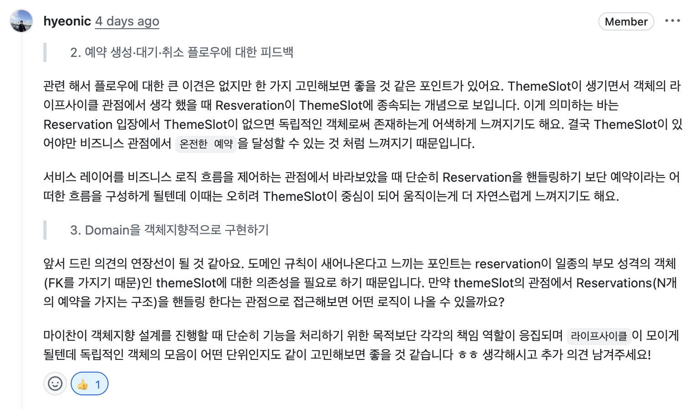

## 1. 문제 인식 및 배경





**대상 클래스**: `Reservation`과 `ThemeSlot` 도메인 객체와 `ReservationService` 

리뷰어가 말씀하시기를 Reservation과 ThemeSlot 객체를 보았을 때,
서비스가 두 객체를 동시에 직접 조율하고 있다는 말을 하였다.

`ReservationService.saveReservation()` 코드를 보면


```java
// 서비스가 ThemeSlot 상태도 직접 건드리고, Reservation 상태도 직접 건드림
themeSlot.swtichIsReserved();           // ThemeSlot 상태 변경
themeSlotRepository.update(themeSlot);  // ThemeSlot 저장
reservation.confirm();                   // Reservation 상태 변경
reservationRepository.save(reservation); // Reservation 저장
```


다음과 같이 두 객체에 대해 동시에 직접 조율을 하고 있다.


`ReservationService.cancelReservation()` 코드도 보면


```java
reservation.cancel();
reservationRepository.updateStatus(reservation);

waitingReservation.ifPresent(Reservation::confirm); // 다음 대기자 확정
reservationRepository.updateStatus(waitingReservation.get());

themeSlotRepository.update(..., false); // ThemeSlot 상태도 직접 변경
```


Service내에서 다음 대기자가 누가 있는지 확인해서 상태를 변경하고, 
themeSlot도 변경하는 도메인 지식을 직접 알고 있는 상황이다.
리뷰어가 말한 것이 도메인 `규칙이 서비스에 새어나온다`는 말씀을 하신거 같다.


### 변경 방향 - 리뷰어가 제안하는 방향


ThemeSlot이 Reservation을 소유하도록 도메인 구조를 변경하고자 한다.


현재 Reservation이 ThemeSlot의 FK를 가지고 있다. 즉, ThemeSlot이 부모이다.
그런데 코드 상으로 ThemeSlot이 자신에게 달려있는 예약들을 알지 못하고, 
알려면 DB를 통해 추가 조회를 해야한다.


ThemeSlot의 변경 후 도메인 객체 코드


```java
// ThemeSlot이 예약 목록을 직접 들고 있는 구조
public class ThemeSlot {
    private Reservations reservations;

    public void addReservation(String name) {
    }

    public void cancelReservation(Long reservationId) {
    }
}
```


### 변경에 대해 정리


Reservation은 ThemeSlot 없이 존재할 수 없으니,
ThemeSlot이 Reservation들을 직접 관리하게 하고,
예약 확정/취소/대기순번 같은 규칙들은 ThemeSlot 안으로 들어가도록 변경하고자 한다.


즉, ThemeSlot을 `Aggregate Root`로 만들고자 한다.


## 2. 문제 상황


3가지 문제 상황에 대해서 변경을 하고자 한다.


### 1. Reservation ↔ ThemeSlot 양방향 순환 참조


두 객체가 서로 참조하고 있어 그대로 추가하면 무한 순환 참조가 생긴다.

- 즉, `높은 결합도`를 갖게 된다.

### 2. Service에 도메인 규칙과 흐름 제어 책임 과중


빈 슬롯이면 CONFIRMED, 취소 시에 대기자 자동 승격, 등등 같은
핵심 판단의 로직이 ReservationService에 존재한다.
이를 도메인 객체만 봐서는 비즈니스의 흐름을 파악할 수 없고, 
흐름 제어와 비즈니스 규칙 2개의 책임을 지고 있다.

- ReservationService가 `단일 책임 원칙(SRP)를 위반` 하게 된다.
- `가독성이 좋지 않고, 이해하기가 어렵다.`
- 예약에 대한 규칙이 Service / ThemeSlot / Reservation에 흩어지게 되어 `낮은 응집도`를 갖는다.

### 3. 컬렉션 로직의 분산


ThemeSlot이 List<Reservation>을 직접 들게 되면 컬렉션의 행동들이 ThemeSlot 안에 섞이게 된다.

- ThemeSlot이 슬롯 책임 + 컬렉션 책임까지 갖게 되어, `단일 책임 원칙(SRP)를 위반` 하게 된다.

### 문제 유형 체크

- [ ] 중복 코드 / 로직
- [ ] 불명확한 이름 (변수, 메서드, 클래스 등)
- [x] 단일 책임 원칙(SRP) 위반 — 너무 많은 역할
- [x] 높은 결합도 — 변경 시 여러 곳에 영향
- [x] 낮은 응집도 — 예약 규칙이 흩어져 있다.
- [ ] 확장하기 어려운 구조 (OCP 위반)
- [x] 테스트하기 어려운 구조
- [ ] 성능 문제
- [x] 가독성 / 이해하기 어려움
- [ ] 기타:

---


## 3. 변경 이유


### **유지보수 측면:**


예약 규칙 도메인과 관련된 내용들은 응집도 있게 한곳에서 관리할 수 있도록 한다. 


### **가독성 측면:**


`themeSlot.cancelReservation(id)` 를 통해 한줄로 취소 전체 흐름을 표현할 수 있게 한다.
`reservations.findFirstPending()` 를 통해 의도를 드러낸다.


### **테스트 용이성 측면:**


도메인 규칙이 ThemeSlot, Reservation 안에 흩어져 있다면 Spring 컨텍스트 없이 Domain 단위 테스트로
비즈니스 규칙을 테스트 할 수 있다.


---


## 4. 변경 방향


### 접근 전략

1. `Reservation`: 에서 참조하던 ThemeSlot 객체 참조를 끊고, reservation.getDate() 등 기존 접근 방법을 보존한다.
2. `ThemeSlot`: Aggregate Root로 도메인 규칙을 흡수하여 Service에 있던 판단 로직을 내부 메서드로 이동시킨다.
3. `Reservations`: themeSlot 안에[ 있던 List<Reservation>을 일급 컬렉션으로 컬렉션 행동을 응집한다.

### 적용할 기법 / 패턴

- [ ] 메서드 추출 (Extract Method)
- [x] 클래스 / 인터페이스 추출 Reservations 클래스 생성
- [ ] 디자인 패턴 적용 (패턴명: )
- [ ] 레이어 / 모듈 분리
- [ ] 의존성 역전 (DIP) 적용
- [ ] 불변 객체 / VO 도입 
- [x] 기타: Aggregate Root 패턴 + 일급 컬렉션

---


## 5. 변경 결과


### 변경된 코드 전 / 후


**예약 저장 메서드 전 / 후**


```java
@Transactional
    public Reservation saveReservation(String name, Long themeSlotId) {
        ThemeSlot themeSlot = getThemeSlotOrElseThrow(themeSlotId);
        validateBeforeDate(themeSlot);
        validateDuplicatedReservation(name, themeSlotId);
        validateDateTime(themeSlot);
        Reservation reservation = new Reservation(name, themeSlot.getId(), themeSlot.getDate(), themeSlot.getTime(), themeSlot.getTheme());

        // RESERVATION 테이블에 ThemeSlot id가 없다면, 바로 themeSlot은 true로, reservation을 confirm로 변경 후 저장
        if (!reservationRepository.existsByThemeSlotId(themeSlotId)) {
            themeSlot.swtichIsReserved();
            themeSlotRepository.update(themeSlot);
            reservation.confirm();
        }

        // RESERVATION 테이블에 ThemeSlot id가 있다면, reservation을 pending 상태로 바로 저장
        return reservationRepository.save(reservation);
    }
```


```java
@Transactional
    public Reservation saveReservation(String name, Long themeSlotId) {
        ThemeSlot themeSlot = themeSlotRepository.findWithReservations(themeSlotId)
                .orElseThrow(() -> new CustomException(ErrorCode.THEME_SLOT_NOT_FOUND));
        validateBeforeDate(themeSlot);
        validateDateTime(themeSlot);
        Reservation reservation = themeSlot.addReservation(name);
        themeSlotRepository.update(themeSlot);
        return reservationRepository.save(reservation);
    }
```


**내 예약 조회 메서드 전 / 후**


```java
public MyReservationResponse findReservationBy(String name) {
        List<Reservation> reservations = reservationRepository.findByName(name);
        List<ReservationResponse> myNotPendingReservation = reservations.stream()
                .filter(reservation -> !reservation.isPendingStatus())
                .map(ReservationResponse::from)
                .toList();

        List<WaitingReservationResponse> waitingReservationResponses = new ArrayList<>();
        // 예약이 PENDING이라면 themeSlot으로 repository에서 List<reservation>를 조회해서 대기 순번을 추출한다.
        for (Reservation reservation : reservations) {
            if (reservation.isPendingStatus()) {
                List<WaitingReservationResponse> pendingReservations = findWaitingReservationWithOrder(reservation.getThemeSlotId());
                WaitingReservationResponse waitingReservationResponse = pendingReservations.stream()
                        .filter(each -> each.name().equals(reservation.getName()))
                        .findFirst()
                        .orElseThrow(() -> new IllegalArgumentException("존재하지 않습니다."));

                waitingReservationResponses.add(waitingReservationResponse);
            }
        }
        return new MyReservationResponse(myNotPendingReservation, waitingReservationResponses);
    }
```


```java
public MyReservationResponse findReservationBy(String name) {
        List<Reservation> reservations = reservationRepository.findByName(name);
        List<ReservationResponse> myNotPendingReservation = reservations.stream()
                .filter(reservation -> !reservation.isPendingStatus())
                .map(ReservationResponse::from)
                .toList();

        List<WaitingReservationResponse> waitingReservationResponses = new ArrayList<>();
        for (Reservation reservation : reservations) {
            if (reservation.isPendingStatus()) {
                ThemeSlot themeSlot = themeSlotRepository.findWithReservations(reservation.getThemeSlotId())
                        .orElseThrow(() -> new CustomException(ErrorCode.THEME_SLOT_NOT_FOUND));
                int order = themeSlot.getReservations().waitingOrderOf(reservation.getId());
                waitingReservationResponses.add(WaitingReservationResponse.from(order, reservation));
            }
        }
        return new MyReservationResponse(myNotPendingReservation, waitingReservationResponses);
    }
```


**예약 취소 메서드 전 / 후**


```java
@Transactional
    public void cancelReservation(Long reservationId) {
        Reservation reservation = getReservationOrElseThrow(reservationId);
        boolean wasConfirmed = reservation.getReservationStatus().equals(ConfirmedStatus.getInstance());
        reservation.cancel();
        reservationRepository.updateStatus(reservation);

        if (wasConfirmed) {
            Optional<Reservation> waitingReservation = reservationRepository.findRecentReservationByThemeSlot(reservation.getThemeSlotId());

            if (waitingReservation.isPresent()) {
                waitingReservation.ifPresent(Reservation::confirm);
                reservationRepository.updateStatus(waitingReservation.get());
            }

            if (waitingReservation.isEmpty()) {
                themeSlotRepository.update(new ThemeSlot(reservation.getTheme(), reservation.getDate(), reservation.getTime(), false));
            }
        }
    }
```


```java
@Transactional
    public void cancelReservation(Long reservationId) {
        Reservation reservation = getReservationOrElseThrow(reservationId);
        ThemeSlot themeSlot = themeSlotRepository.findWithReservations(reservation.getThemeSlotId())
                .orElseThrow(() -> new CustomException(ErrorCode.THEME_SLOT_NOT_FOUND));

        Optional<Reservation> promotedReservation = themeSlot.cancelReservation(reservationId);
        reservationRepository.updateStatus(themeSlot.findReservationById(reservationId));
        promotedReservation.ifPresent(reservationRepository::updateStatus);
        themeSlotRepository.update(themeSlot);
    }
```


### 변경의 효과와 장점

- 도메인 규칙들에 대한 위치가 ThemeSlot 내부로 이동하였다.
- 대기 순번 계산 로직이 ReservationService → Reservations로 이동
- 컬렉션 행동들에 대한 위차가 Reservations 내부로 이동하였다.
- themeSlot의 역할은 슬롯에 대한 책임과 Reservations에 대한 책임 분리
- Service의 역할은 흐름 제어의 역할만 함

