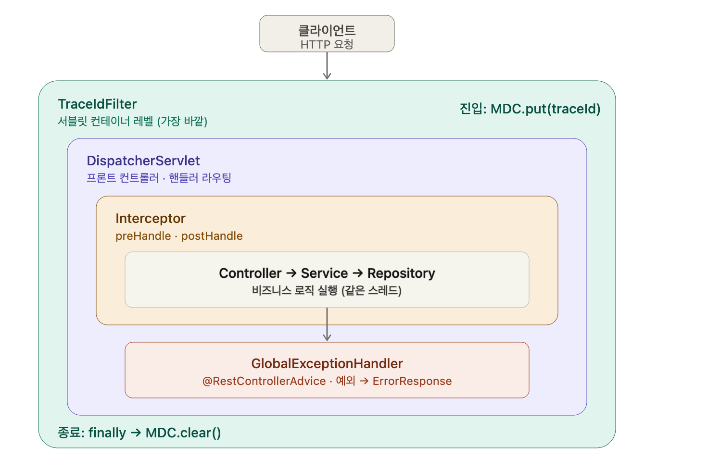

## 어떤 개념일까?


TraceId는 어떤 목적으로 사용할까?


```java
@Component
public class TraceIdFilter implements Filter {
    @Override
    public void doFilter(ServletRequest request, ServletResponse response, FilterChain chain)
            throws IOException, ServletException {
        try {
            MDC.put("traceId", UUID.randomUUID().toString());
            chain.doFilter(request, response);
        } finally {
            MDC.clear();
        }
    }
}
```


```java
@ExceptionHandler(CustomException.class)
    public ResponseEntity<ErrorResponse> handleCustomException(
            CustomException customException, HttpServletRequest httpServletRequest
    ) {
        ErrorResponse errorResponse = new ErrorResponseBuilder()
                .httpStatus(customException.getErrorCode().getHttpStatus())
                .errorMessage(customException.getErrorCode().getMessage())
                .apiUrl(httpServletRequest.getRequestURI())
                .timeStamp(LocalDateTime.now())
                .traceId(MDC.get("traceId"))
                .build();

        return ResponseEntity.status(customException.getHttpStatus()).body(errorResponse);
    }
```


이 로그가 어느 요청에서 나온 것인지 추적할 수 있게 해주는 장치의 목적으로 사용한다.


운영 환경에서 여러 사용자의 요청이 동시에 들어오게 된다.


톰캣은 요청마다 스레드를 하나씩 붙여서 처리하므로, 로그는 시간순으로 뒤섞여 찍힌다.


```java
12:00:01.100 INFO  예약 생성 시작
12:00:01.105 INFO  예약 생성 시작     ← B 사용자
12:00:01.110 INFO  테마 슬롯 조회
12:00:01.120 ERROR 중복 예약입니다     ← 이 에러는 누구 요청?
12:00:01.125 INFO  테마 슬롯 조회
```


```java
12:00:01.100 [a1b2] INFO  예약 생성 시작
12:00:01.105 [c3d4] INFO  예약 생성 시작
12:00:01.110 [a1b2] INFO  테마 슬롯 조회
12:00:01.120 [a1b2] ERROR 중복 예약입니다
```


### MDC를 활용한 TraceId


MDC.put(”traceId”, …)을 사용하는데,
먼저 MDC(Mapped Diagnostic Context)는 SLF4J/Logback이 제공하는 ThreadLocal 기반 key-value 저장소이다.


같은 스레드 = 같은 요청 안에서는 필터에서 한번 put한 traceId를 컨트롤러, 서비스, 레포지토리 어디든 파라미터로 들고 다니지 않아도 꺼내서 쓸 수 있다.
횡단 관심사를 통해 처리할 수 있다.


### 왜 Interceptor가 아니라 Filter일까


Filter는 서블릿 컨테이너 레벨, 즉 DispatcherServlet보다 바깥 영역에 있다.
traceId는 요청 처리 전체를 감싸야 하므로 가장 바깥에서 set하고 바깥에서 정리하는게 맞다.
Interceptor는 DispathcerServlet이후에 동작하므로, 그 앞단에서 벌어지는 일이나 다른 필터의 로그는 traceId 없이 찍히게 된다.





---


## 어떤 문제를 해결하려고 나왔을까? 왜 사용 할까?


---


## 어떻게 동작하나?


---


## 언제 쓰고, 언제 안 쓰나?


### 쓸 때:


### 안 쓸 때:


---


## 남에게 설명한다면 어떻게 설명할 것인가?


---


## 추가 궁금한 질문들


